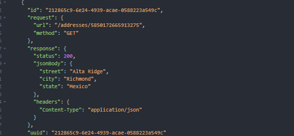
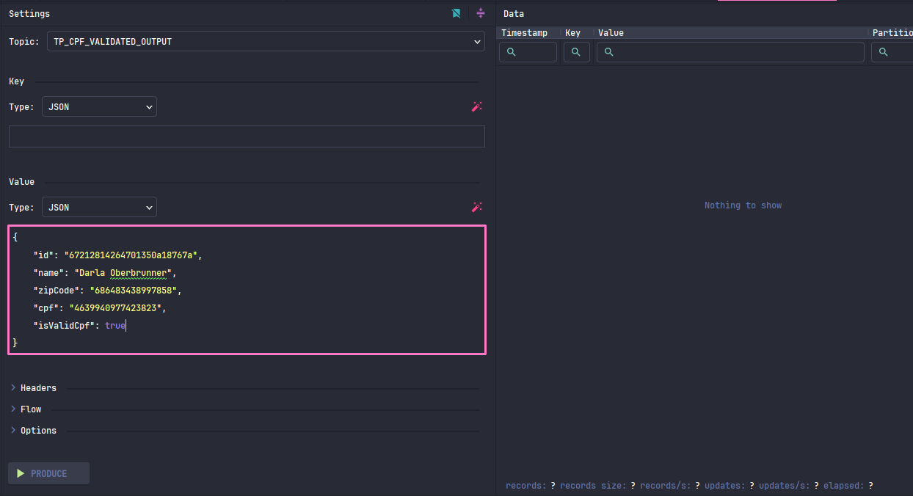

# Estudo de arquitetura hexagonal + kotlin + kafka

## Requerimentos para o ambiente:
- JDK 21
- Docker
- Docker Compose

### Preparando ambiente
- docker: na pasta docker-env, execute: docker-compose up -d
- para acessar o wiremock use a collection do insominia na pasta [collection-wiremock](docker-env/insomnia/collection/Insomnia_wiremock.yaml)
  - mappings-get-all: para ver todos os mapeamentos possiveis
  - mapping-add para adicionar um novo endereço. usei o faker para ser automatico
  - mapping-delete-one: excluir o mapeamento (por id)
  - address-get-one: forma de como resgatar um endereço.
- adicione alguns endereços com mapping add (irá gerar automatico com o insomnia ao chamar a request)

- acessar banco de dados: http://localhost:8081
- (Kafka) acessar fila kafka: http://localhost:9000. Adicionar um novo topico em: new -> Topic name -> TP_CPF_VALIDATION_INPUT (create)
- (RabbitMQ) acessar http://localhost:15672/ com credenciais (guest/guest) e criar queue: Queues and Streams -> input Name -> TP_CPF_VALIDATION_INPUT (btn Add Queue) 
- rode o projeto com springboot, ide, comando, etc
- para facilitar criei uma collection com as operações de entreda e leitura da api [collection-api](docker-env/insomnia/collection/Insomnia_api.yaml)
- para facilitar o teste nao criarei uma api de validação de cpf. Somente irei publicar uma mensagem no topico de resposta de validação.

